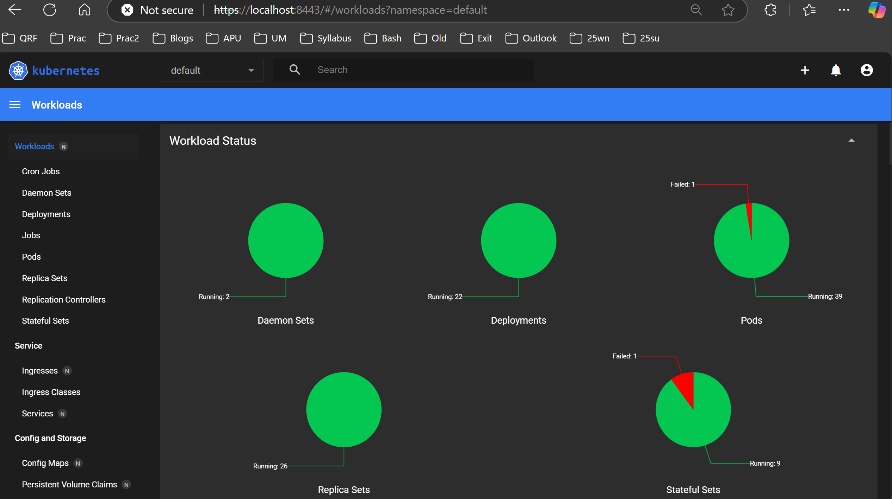
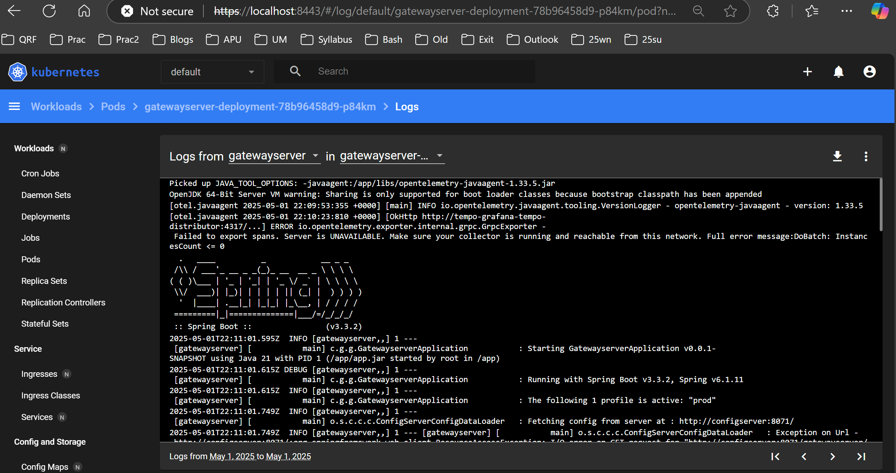
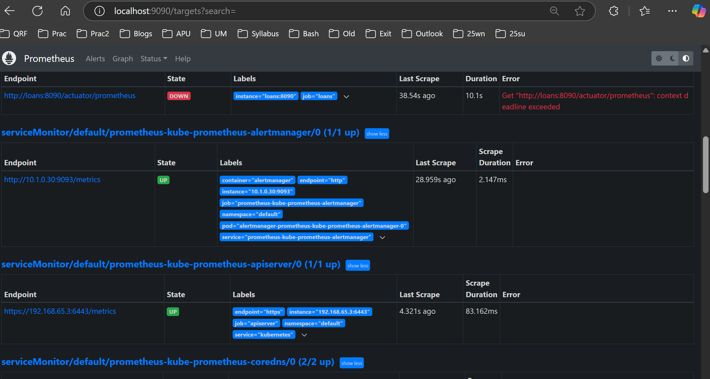
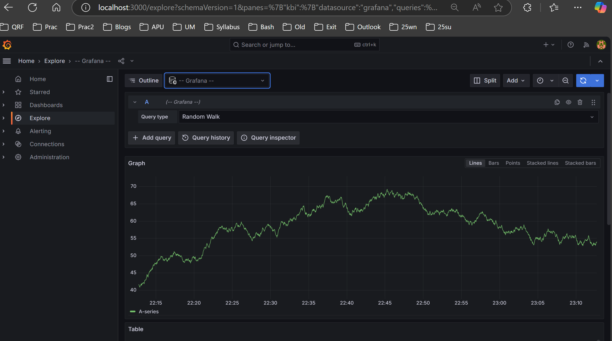
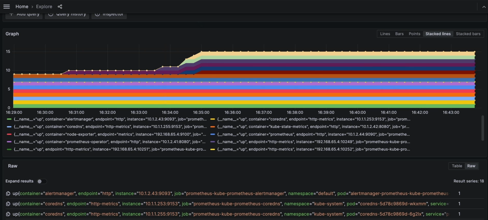
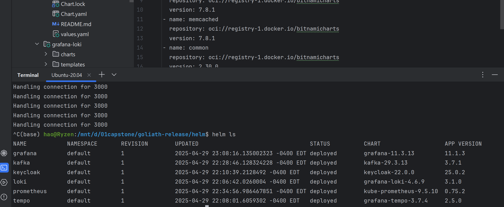
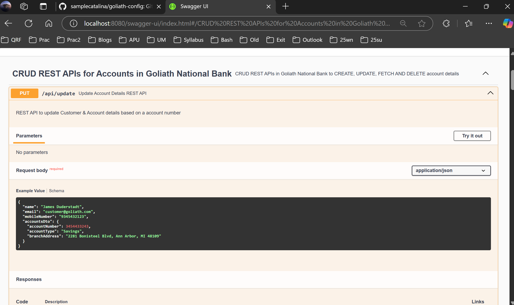

# Goliath National Bank

## Table of Contents

* [Overview](#overview)
* [Architecture](#architecture)
* [Key Features](#key-features)
* [Technology Stack](#technology-stack)
* [Getting Started](#getting-started)

  * [Prerequisites](#prerequisites)
  * [Installation](#installation)
  * [Running Locally](#running-locally)
* [Deployment](#deployment)
* [Monitoring & Observability](#monitoring--observability)
* [Security](#security)
* [Contributing](#contributing)
* [License](#license)
* [Contact](#contact)

---

## Overview

Goliath National Bank is a cloud-native, microservices-based distributed banking system designed to showcase modern best practices in design, security, scalability, and resilience. This project simulates a full-featured banking backend that can handle high throughput, secure communication, and robust fault tolerance.


*Kubernetes Dashboard: Deployment Workload*


*Kubernetes Dashboard: Individual Pod Log*


*Prometheus Dashboard*


*Grafana Dashboard for Service Monitor*


*Grafana Dashboard for Service Monitor*


*Deployed Helm Services*


*Swagger API Documents*


## Architecture

The system is structured around independently deployable microservices written in Java Spring Boot, each encapsulating a distinct domain context (e.g., Accounts, Cards, Loans, Message). Services are containerized with Docker and orchestrated via a Kubernetes cluster, leveraging an Istio service mesh for secure service-to-service communication.


## Key Features

* **Microservices Architecture**: Decoupled services for user services, configserver, gatewayserver, etc.
* **Event-Driven Communication**: Apache Kafka with Spring Cloud Stream ensures reliable, asynchronous messaging.
* **Service Mesh Security**: Istio enforces mTLS for all east–west traffic, enhancing inter-service encryption and identity.
* **Resilience Patterns**: Integrated Resilience4j for rate limiting, bulkheads, retries, and circuit breakers.
* **Service Discovery & Load Balancing**: Kubernetes DNS-based discovery and Ingress controllers manage traffic distribution.
* **Observability Pipeline**: Metrics via Micrometer/Actuator, distributed tracing with OpenTelemetry, persisted in Prometheus and Tempo, visualized in Grafana.

## Technology Stack

* **Language & Framework**: Java 21, Spring Boot, Spring Cloud Stream
* **Datastore**: In-memory H2 Database (for rapid prototyping)
* **Containerization**: Docker
* **Orchestration**: Kubernetes (Helm charts for resource templating)
* **Service Mesh**: Istio
* **Messaging**: Apache Kafka
* **Resilience**: Resilience4j
* **Observability**: Spring Actuator, Micrometer, OpenTelemetry, Prometheus, Tempo, Grafana

## Getting Started

### Prerequisites

* Java 21 SDK
* Docker Desktop
* Kubernetes CLI (kubectl)
* Helm
* A Kubernetes cluster (e.g., Minikube, Kind, EKS)
* At least 16 GB of available RAM if runs locally

### Installation

1. **Clone the repo**

   ```bash
   git clone https://github.com/samplecatalina/goliath-national.git
   cd goliath-national
   ```
2. **Build services**
    For each service,
   ```bash
   ./mvnw clean package -DskipTests
   ```
3. **Package Docker images**

   ```bash
   docker build -t gnb/account-service:latest ./account-service
   docker build -t gnb/transaction-service:latest ./transaction-service
   docker build -t gnb/notification-service:latest ./notification-service
   ```

## Deployment

In project root directory, run:

```bash
cd .\kubernetes\
kubectl apply -f .\kubernetes-discoveryserver.yml 
cd ..\helm\
helm install keycloak keycloak 
helm install kafka kafka 
helm install prometheus kube-prometheus
helm install loki grafana-loki
helm install tempo grafana-tempo
helm install grafana grafana
cd .\environments\
helm install goliath prod-env 
```

Check rollout status:

```bash
kubectl rollout status deployment/account-service -n goliath
kubectl rollout status deployment/transaction-service -n goliath
kubectl rollout status deployment/notification-service -n goliath
```

To enable Kubernetes Dashboard, run the following in a separate terminal and keep this terminal always alive:
```bash
kubectl -n kubernetes-dashboard port-forward svc/kubernetes-dashboard-kong-proxy 8443:443
```
then go to `localhost:8443`.

Refer to Kubernetes Dashboard [documents](https://kubernetes.io/docs/tasks/access-application-cluster/web-ui-dashboard/) for more information.

To delete and clean up, run: 

```bash
helm uninstall goliath 
helm uninstall grafana 
helm uninstall tempo 
helm uninstall loki 
helm uninstall prometheus 
helm uninstall kafka 
helm uninstall keycloak 
cd ..\kubernetes\
kubectl delete -f .\kubernetes-discoveryserver.yml 
```


## Monitoring & Observability

* **Metrics**: Exposed via Spring Actuator/Micrometer at `/actuator/prometheus`.
* **Tracing**: All services instrumented with OpenTelemetry SDK, exporting to Tempo.
* **Dashboard**: Grafana is pre-configured to visualize service metrics, latency, and error rates.

## Security

* **Mutual TLS (mTLS)**: Istio sidecar proxies enforce encryption for all service-to-service traffic.
* **API Gateway**: NGINX Ingress with JWT validation plugin (configurable via `values.yaml`).
* **Database Security**: Services connect to H2 with in-memory credentials for demo; swap out for Vault-managed secrets in production.

